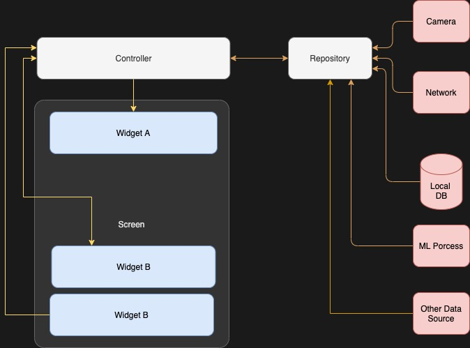

<b>Flutter MNC Code Standard Extention</b>

  
  
<i>Implementation of MNC Flutter Code Standard</i>

Extention are created to the way to :
- Simplify and Unified way of structure code
- Ease to write
- Minimize the learning curve

## Features
- Module Generator
- Widget File Creator

## Module Generator

### Module 

### Controller
The Controller module represents the logic of data flow within the application. It is the middle layer between the Repo and Screen layers. The Controller is responsible for updating the pipe when the data changes.
### Data
The Data module defines the IO logic of the application. This module must have a Repository the source data can be various and send data to Controller.
### Screen
The Screen module represents entry point of route and page of current app.
### Test
The Test module are place for current module unit, widget and integration test.
### Widget
The Widget module are place for current module widgets.

